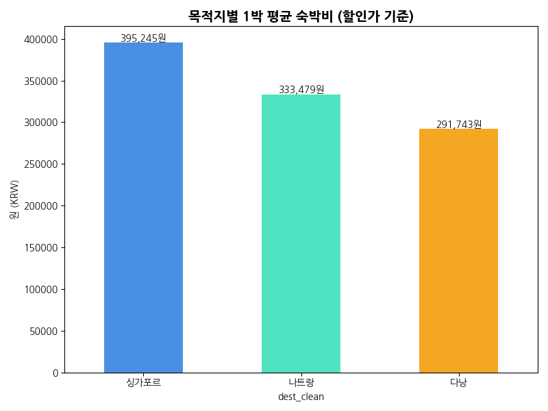
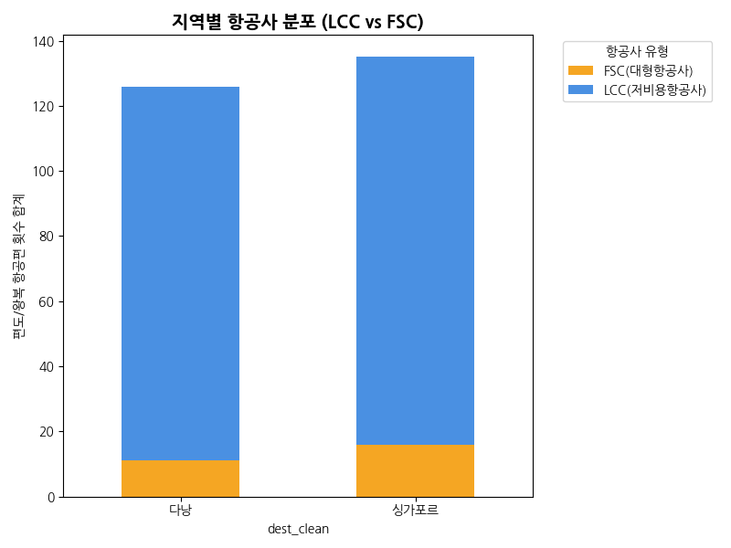
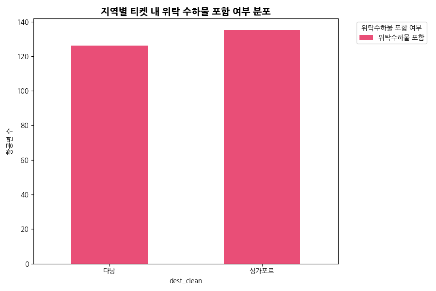
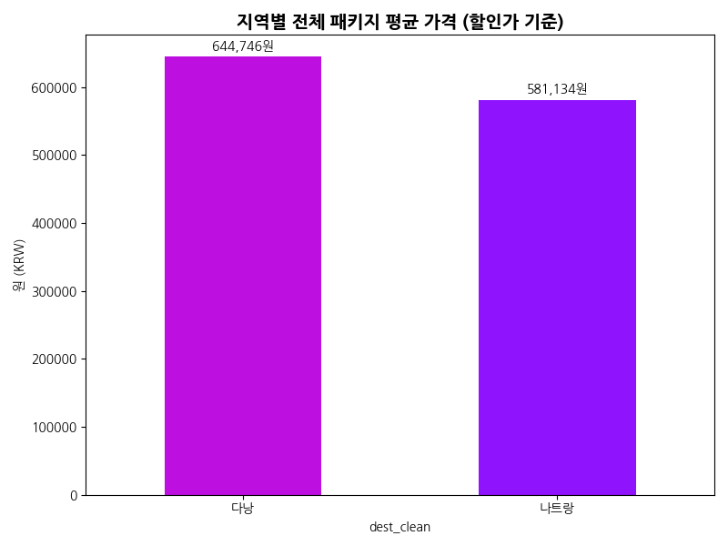

# 휴양형(다낭, 나트랑) vs 관광형(싱가포르)
## ✈️ 상품 구조 EDA 및 수요 예측
**데이터 기반 목적지별 상품 구조 비교 분석**

---

## 1. 지역별 평균 숙박비 비교
다낭과 나트랑 등 휴양지는 **4~5성급 프리미엄 리조트/풀빌라**가 많음에도 불구하고, 물가가 높은 '싱가포르'와 비교했을 때 전체적인 시장 **객실 단가가 큰 격차**를 보입니다. 

이는 전형적인 가성비 휴양 포지셔닝에 기인합니다.

---

## 2. 지역별 항공사 수요 구조 (LCC vs FSC)
운항 중인 항공편의 **LCC(저비용항공사)**와 **FSC(대형항공사)**의 비율 비율입니다.

- **다낭/나트랑 (휴양지)**: 가격 경쟁력과 단기 가족/방학 휴가 수요가 매우 높기 때문에 LCC(티웨이, 비엣젯 등) 편성이 압도적입니다.
- **싱가포르 (관광/상용)**: 프리미엄 관광 및 비즈니스 상용 고객 수요가 기반이 되어 FSC 비중이 눈에 띄게 나타납니다.

---

## 3. 위탁 수하물 포함 비중 비교
가장 직관적인 **'저렴한 상품 구조'**의 지표입니다. 

휴양지의 경우 기본 운임의 가격 경쟁력을 극대화하기 위해 '위탁수하물 미포함 티켓' 옵션이 매우 적극적으로 판매되는 특성을 띕니다.

---

## 4. 최종 패키지 가격 구조 비교 (할인가)
항공+호텔+일정이 모두 결합된 상품의 최종 예약 평균가입니다.

휴양형 패키지는 결론적으로 고객들이 체감하는 시작 예약 가격이 낮게 형성되어 (의무 쇼핑 등으로 마진 보전) **대규모 대중(Mass) 수요**를 강력하게 견인하게 됩니다.

---

## 💡 분석 시사점 요약 (수요 예측)

- **🏝️ 휴양형 목적지 (다낭/나트랑)**
  - 극강의 **'가격 타겟팅' 상품 구조** 
  - (LCC 위주 집중, 수하물 옵션 별도화, 낮은 객실평균가, 쇼핑옵션 추가 등)
  - 이를 무기로 **넓은 계층의 대중적인 가족/연인 수요**를 대규모로 창출합니다.

- **🏙️ 관광형 목적지 (싱가포르)**
  - 뺄셈 구조의 상품보다는 도심 입지와 양질의 항공사가 포함된 **프리미엄 관광 및 비즈니스형 상품**으로 뚜렷이 구분 됨을 데이터로 확인했습니다.
