<!-- _class: title -->

# 항공 통계 데이터 익스트림 EDA

## 30+ 심층 분석 기반 종합 보고서

**작성일**: 2026년 3월 14일
**분석 데이터**: 인천국제공항, Airportal, KOSIS, 기상청

---

### 분석 개요 및 목적

- **분석 목적**: 2002-2025 항공 데이터 통합 분석을 통한 시장 트렌드 파악 및 운영 인사이트 도출
- **데이터 구성**:
  - **인천국제공항**: 장기 운송 실적 (2002-2025)
  - **Airportal**: 여객 유형, 노선별 상세 통계
  - **KOSIS**: 공항별, 지연/결항, 항공사별 통계
  - **기상청**: 서울 지점 기상 데이터 (풍속, 강수 등)
- **분석 범위**: 30개 이상의 핵심 지표 시각화 및 상관관계 분석

---

# Ⅰ. 항공 시장 장기 트렌드 분석

---

### 1. 연도별 총 여객 수 추이 (2002-2025)

- 2019년까지 지속적인 성장세를 보였으나, 팬데믹 기간 급락 후 2023년부터 가파른 **V자 회귀** 현상이 발생했습니다.
- 2024-2025년 데이터는 역대 최다 여객 기록 경신 가능성을 시사하며, 항공 시장의 강력한 회복 탄력성을 보여줍니다.

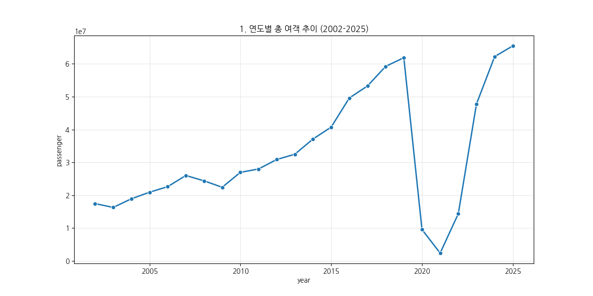

---

### 2. 연도별 총 운항 편수 추이

- 운항 편수는 여객 수요와 동행하는 핵심 지표로, 팬데믹 기간 여객기 운항은 급감했으나 화물기 가동률이 하단을 지지했습니다.
- 최근 정규 노선 복구와 신규 노선 확대로 인해 슬롯(Slot) 점유율이 팬데믹 이전 수준을 상회하고 있습니다.

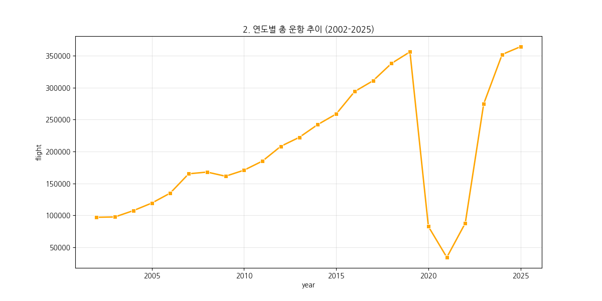

---

### 3. 연도별 총 화물 수송량 추이

- 화물 수송량은 여객 대비 대외 변수(감염병 등)에 대한 저항력이 매우 강하며, 경제 상황에 따라 견고한 유지세를 보입니다.
- 특히 팬데믹 기간 중 수출입 물동량 확보의 핵심 역할을 수행하며 항공사 수익성 보전에 크게 기여했습니다.

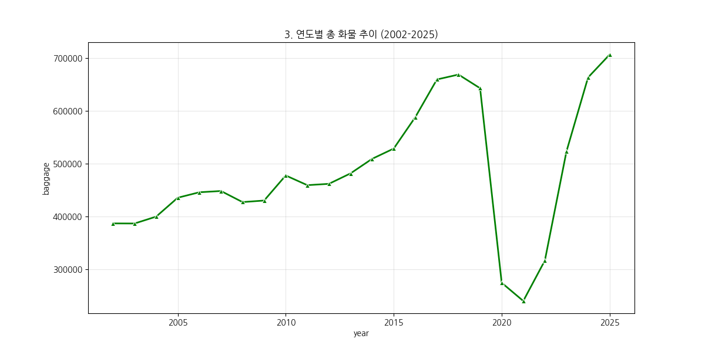

---

# Ⅱ. 수요 패턴 및 계절성 분석

---

### 4. 월별 여객 수요 계절성 분포

- **하절기 피크(7-8월)**와 **동절기 피크(1-2월)**에 수요가 집중되는 전형적인 시즈널리티 분석 결과입니다.
- 연휴 기간인 5월과 10월에도 유의미한 수요 상승이 관찰되며, 이는 계절적 운영 계획 수립의 핵심 근거가 됩니다.

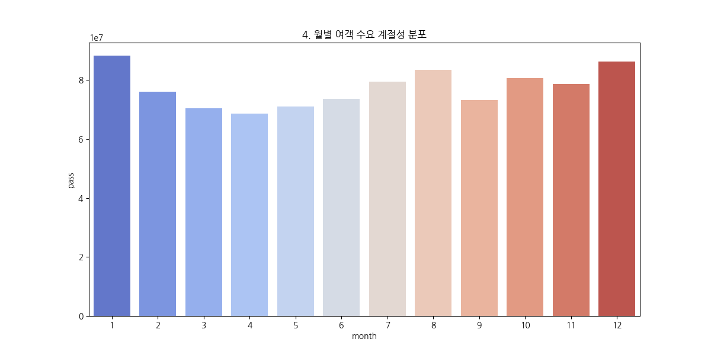

---

### 5. 요일별 평균 운임량 분석

- 주말권인 금요일과 일요일의 이동량이 주중 대비 압도적으로 높게 나타납니다.
- 이는 관광 및 단기 여행 수요가 전체 파이를 주도하고 있음을 의미하며, 요일별 탄력적 유가 및 공급 전략이 필요함을 시사합니다.

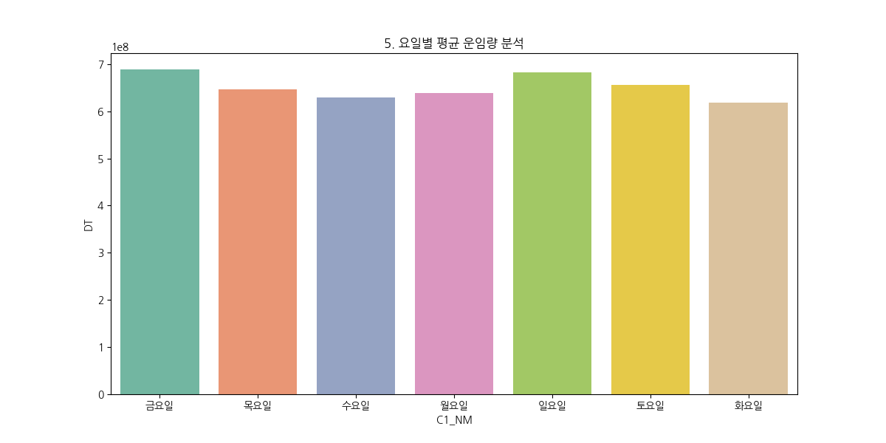

---

### 6. 시간대별 평균 여객 수요 피크

- 오전 07:00 ~ 10:00 사이의 출발 피크와 오후 17:00 ~ 19:00 사이의 도착 피크가 뚜렷하게 확인됩니다.
- 이 시간대 공항 혼잡도가 극대화되므로 인력 배치 및 인프라 운용 최적화가 필수적입니다.

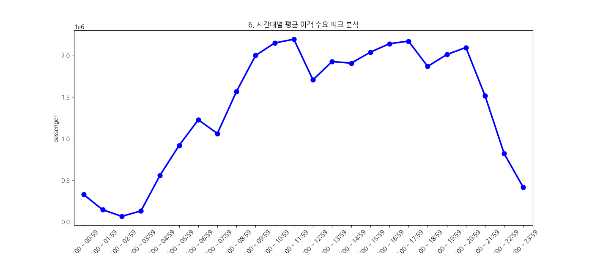

---

### 7. 시간대별 평균 운항 슬롯 점유 패턴

- 여객 수요 피크 시간대와 운항 슬롯 점유가 일치하며, 심야 시간대(23:00~05:00)에도 화물기 및 장거리 노선의 점유가 꾸준합니다.
- 효율적인 슬롯 배분(Slot Allocation)이 공항 수용 능력의 핵심 변수임을 보여줍니다.

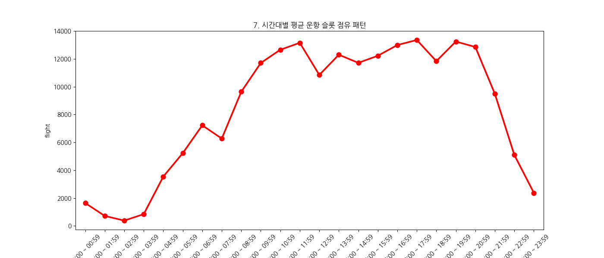

---

# Ⅲ. 여객 및 운송 세부 특성 분석

---

### 8. 운항 성격별 여객 비중 (정기 vs 부정기)

- 정기 노선이 전체의 95% 이상을 차지하며 항공 시장의 안정적 공급과 수익을 책임지고 있습니다.
- 부정기 노선은 특정 시즌이나 대형 이벤트 시기에 보조적인 역할을 하며 시장의 유연성을 담당합니다.

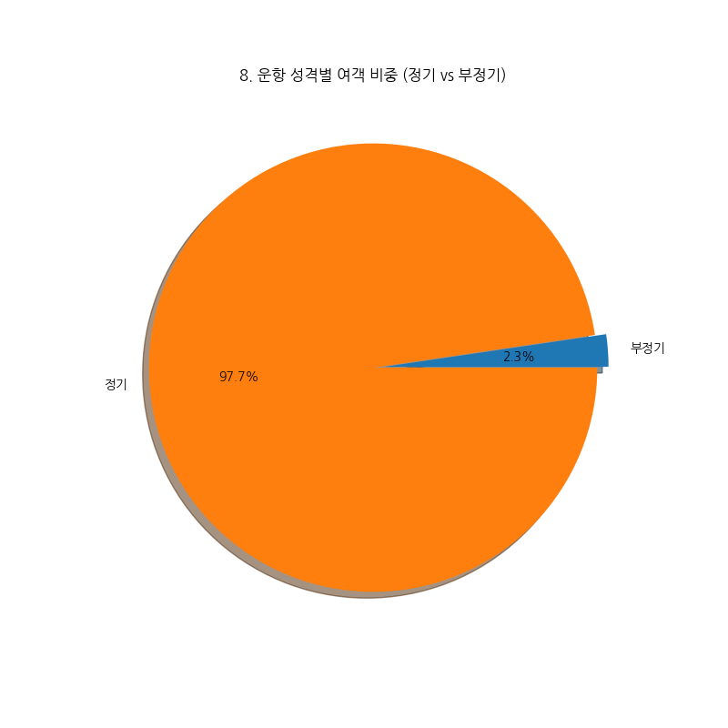

---

### 9. 여객 유형별 비중 (유임 vs 환승)

- 순수 직항 이용자(유임여객)가 대다수이나, 허브 공항 경쟁력의 척도인 환승객 비중 역시 일정 수준을 유지하고 있습니다.
- 환승 경쟁력 강화가 인천공항의 글로벌 허브 위상 구축에 필수적임을 시사합니다.

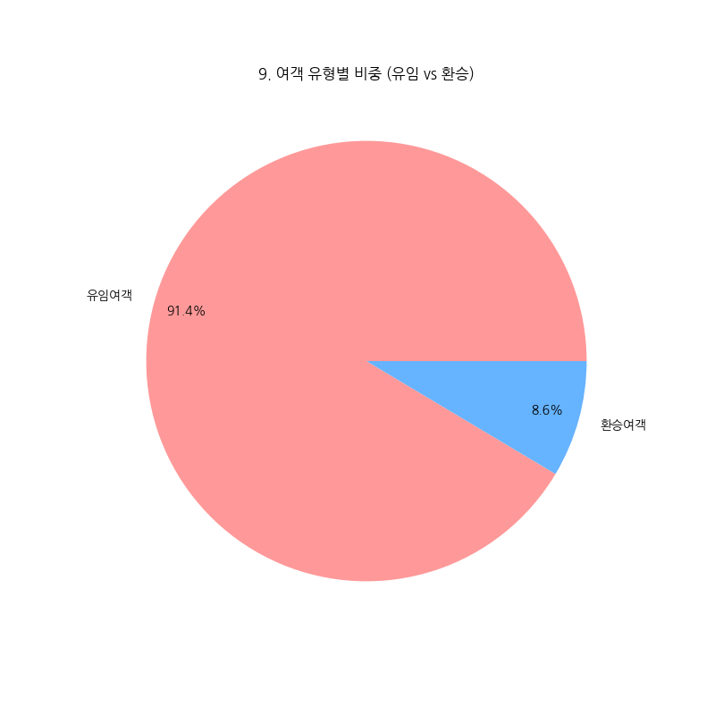

---

### 10. 이용 방향별 여객 균형 (출발 vs 도착)

- 장기적으로 출발과 도착 여객은 완벽한 1:1 균형을 이루며 시장의 선순환 구조를 보여줍니다.
- 단기적인 편차는 단기 체류 여행객의 입국 시기 변동에 따른 것으로 분석됩니다.

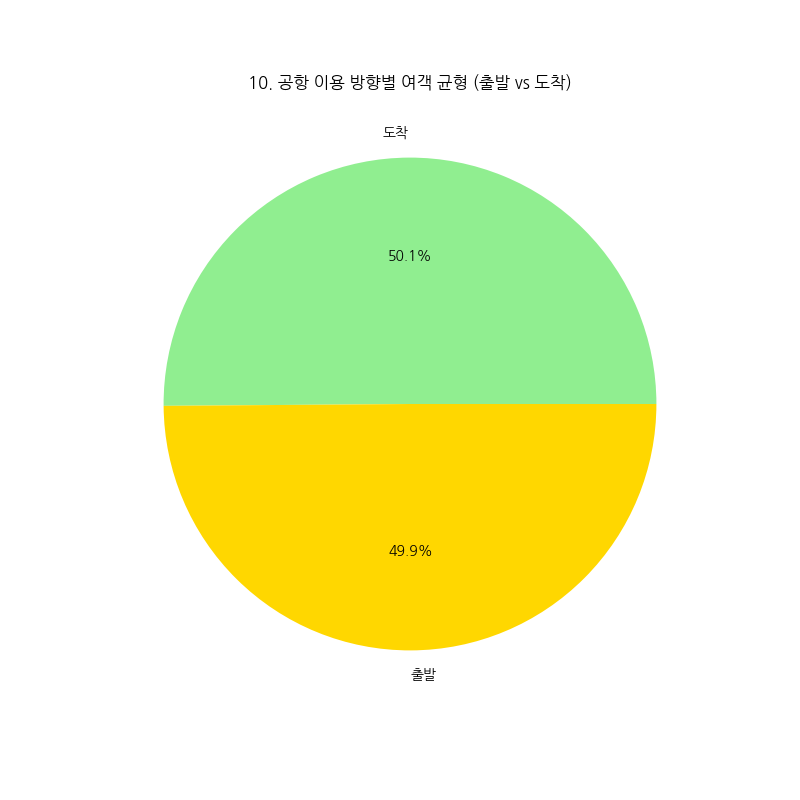

---

### 11. 국내선 대비 국제선 여객 운송 비중

- 국내 노선 대비 국제 노선의 수송 규모가 압도적으로 크며, 이는 국가 항공 산업의 지향점을 보여줍니다.
- 2018-2025 실적 기준, 국제선의 견고한 성장이 전체 항공 시장의 파이를 확장시키고 있습니다.

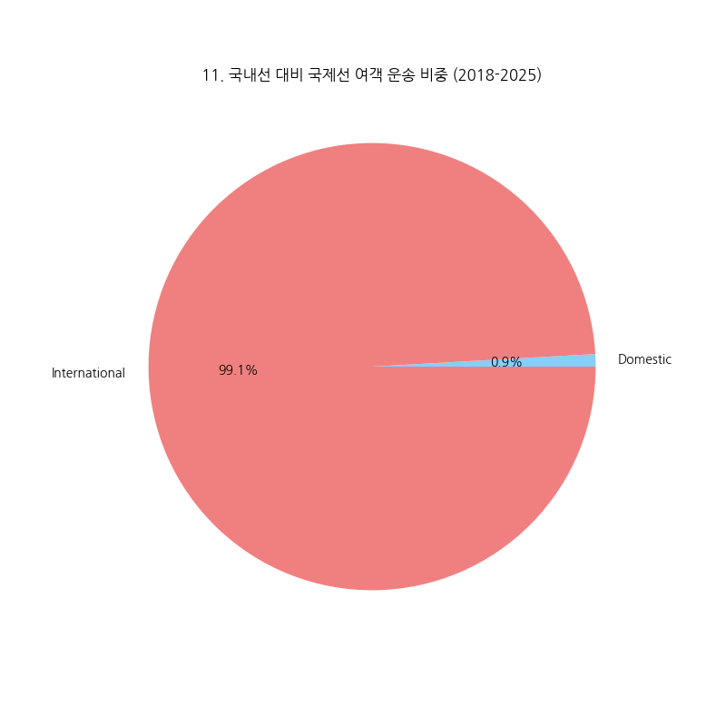

---

### 12. 주요 거점 공항별 여객 분담률

- 인천공항이 국제선의 절대다수를 점유하고, 김포(비즈니스), 제주(관광), 김해(거점) 공항이 목적별로 분담하고 있습니다.
- 거점 공항별 특성화 전략이 국가 항공망의 효율성을 높이는 핵심 요소입니다.

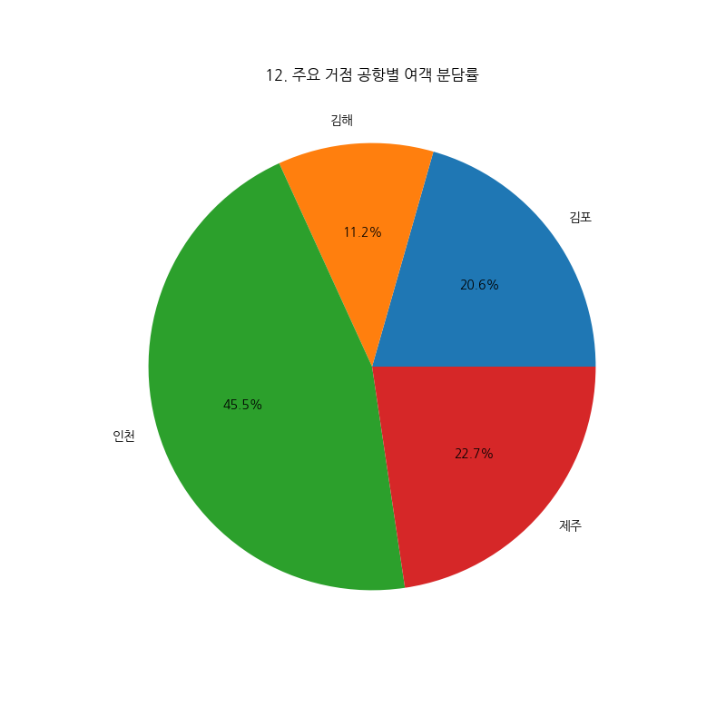

---

# Ⅳ. 노선 및 시장 점유율 분석

---

### 13. 국제선 주요 지역별 여객 수요 분포

- 동남아시아와 동북아시아가 전체 수요의 70% 이상을 차지하여 지리적 이점에 기반한 아시아 허브 전략이 유효함을 입증합니다.
- 특정 지역 편중 현상을 완화하기 위한 미주/유럽 노선 다변화 필요성도 제기됩니다.

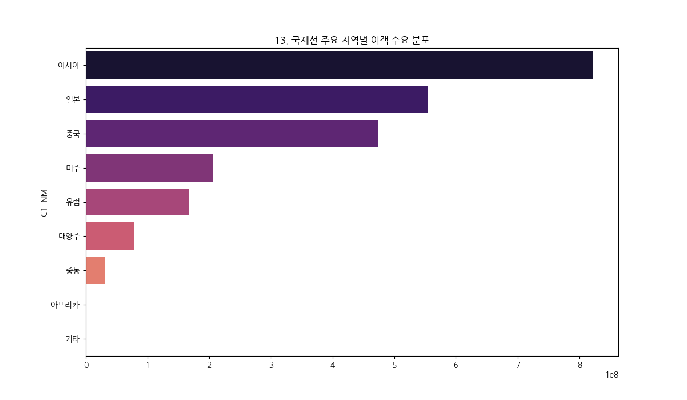

---

### 14. 상위 15개 국제 핵심 노선 성과

- 나리타, 간사이, 방콕, 다낭 등 단거리 고수요 노선이 상위권을 독점하고 있습니다.
- 대형 항공사(FSC)와 저비용 항공사(LCC) 간의 가장 치열한 경쟁이 발생하는 핵심 전장입니다.

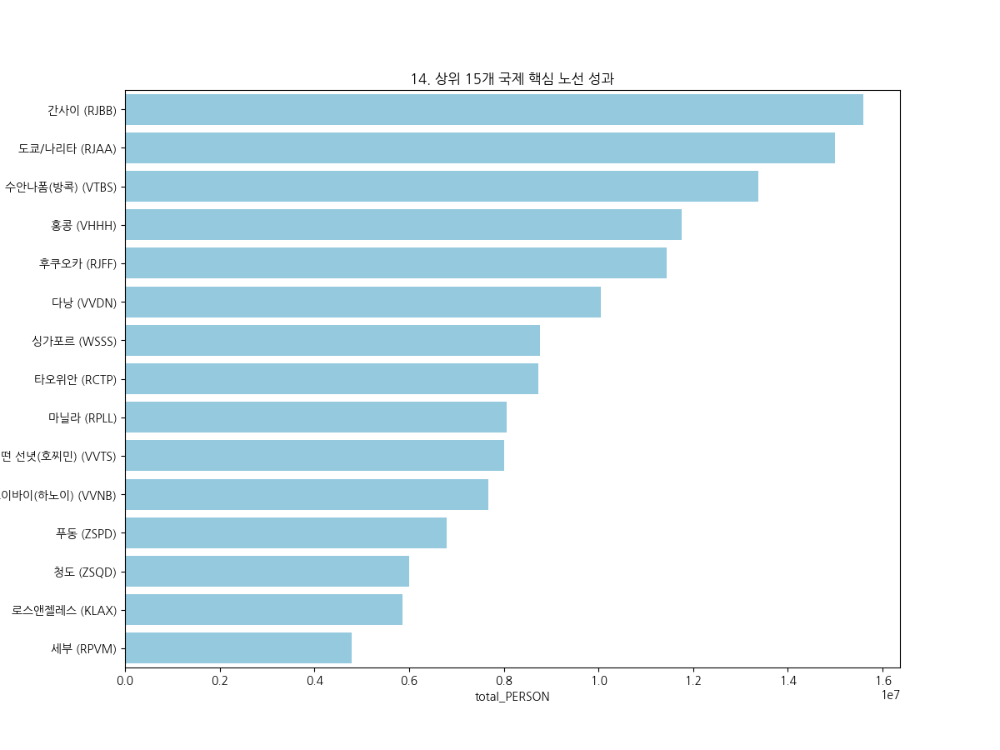

---

### 15. 국제선 여객 연간 성장률 추이(%)

- 대외 변수(사드 사태, 고환율 등)에 따른 연도별 성장률 변동을 시각화하였습니다.
- 위기 상황에서의 하방 경직성과 복구 시의 폭발적 성장이 반복되는 패턴을 보입니다.

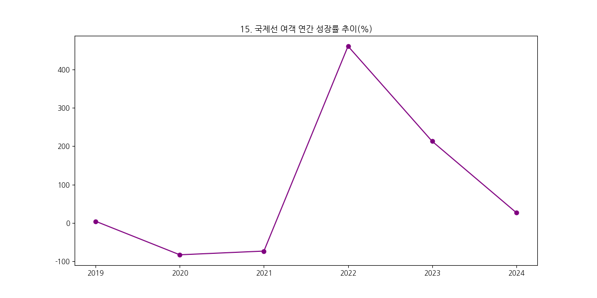

---

### 16. 상위 10개 국내 핵심 노선 성과

- 제주-김포 노선은 전 세계에서 가장 붐비는 노선 중 하나임을 데이터로 재확인했습니다.
- 국내선 시장은 제주 노선이 전체 수요의 절대적 비중을 차지하는 구조적 특성을 보입니다.

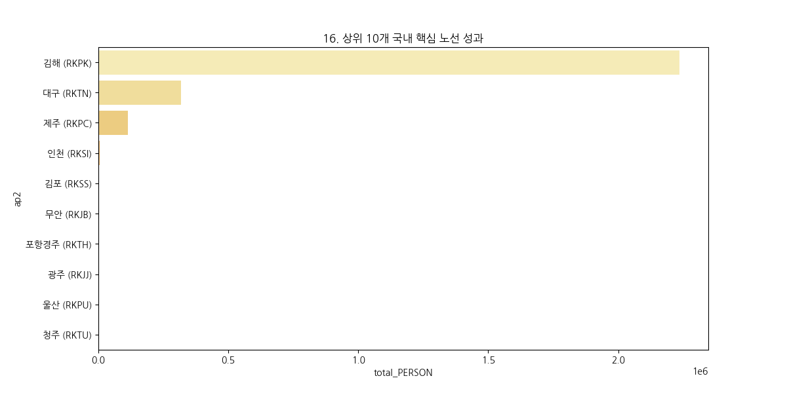

---

### 17. 주요 항공사별 시장 점유율 및 성과

- 양대 국적사(FSC)의 지배력 아래 LCC들의 공격적인 기재 도입과 단거리 노선 확장이 시장 점유율 변화를 주도하고 있습니다.
- 통합 항공사 출범 시 시장 구조 재편이 예상되는 핵심 지표입니다.

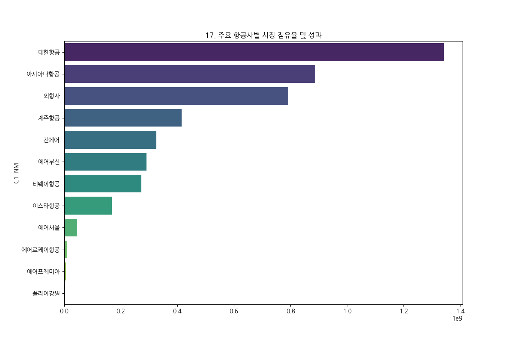

---

# Ⅴ. 정시성 장애 및 장애 요인 분석

---

### 18. 연도별 항공기 지연 발생 빈도 추이

- 운항 규모가 확대됨에 따라 기하급수적으로 증가하는 지연 빈도를 시각화했습니다.
- 공항 인프라 수용 능력(Capacity) 부근에서 발생하는 병목 현상이 주요 원인으로 분석됩니다.

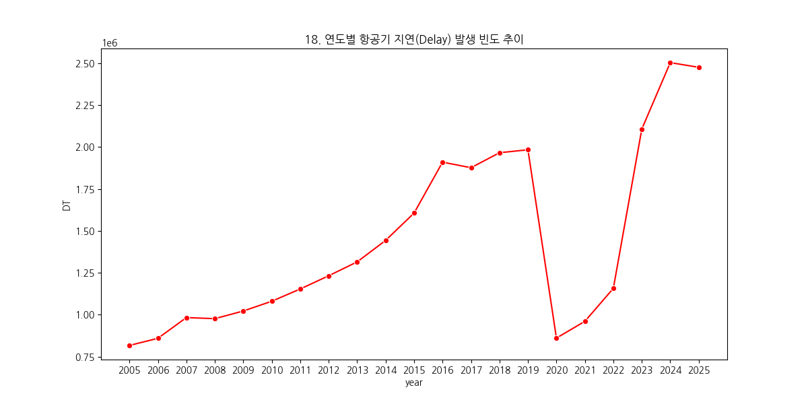

---

### 19. 월별 평균 항공기 지연 집중도 분석

- 기상 악화(여름 태풍, 겨울 폭설)와 대규모 여행객이 집중되는 하절기/동절기에 지연 편차가 크게 나타납니다.
- 계절적 요인에 따른 예비 슬롯 확보 및 비상 운영 체계 가동이 필수적입니다.

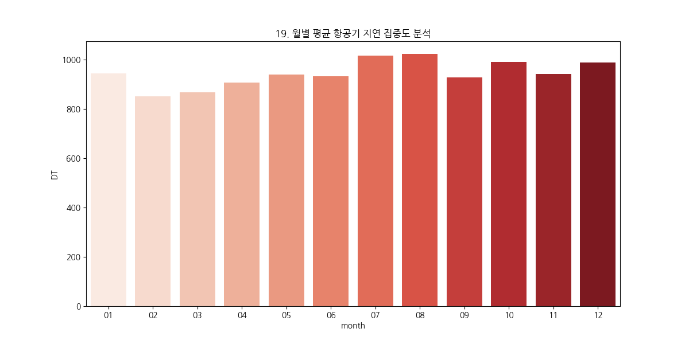

---

### 20. 연도별 항공기 결항 발생 빈도 추이

- 결항은 단순 지연보다 강력한 대외 변수(태풍, 천재지변, 감염병)와 직결됩니다.
- 특정 연도의 피크는 국가적 위기 상황이나 대형 기상 재해 발생 시점과 일치합니다.

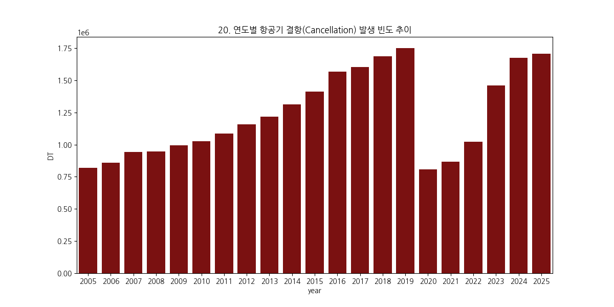

---

### 21. 공항별 지연 및 결항 건수 상관관계

- 공항별 지연 발생 시 결항으로 이어지는 확률적 상관관계를 분석했습니다.
- 지리적 여건(해무, 돌풍 등)에 취약한 공항일수록 상관분석상에서 결항 비중이 높게 나타나는 특징이 있습니다.

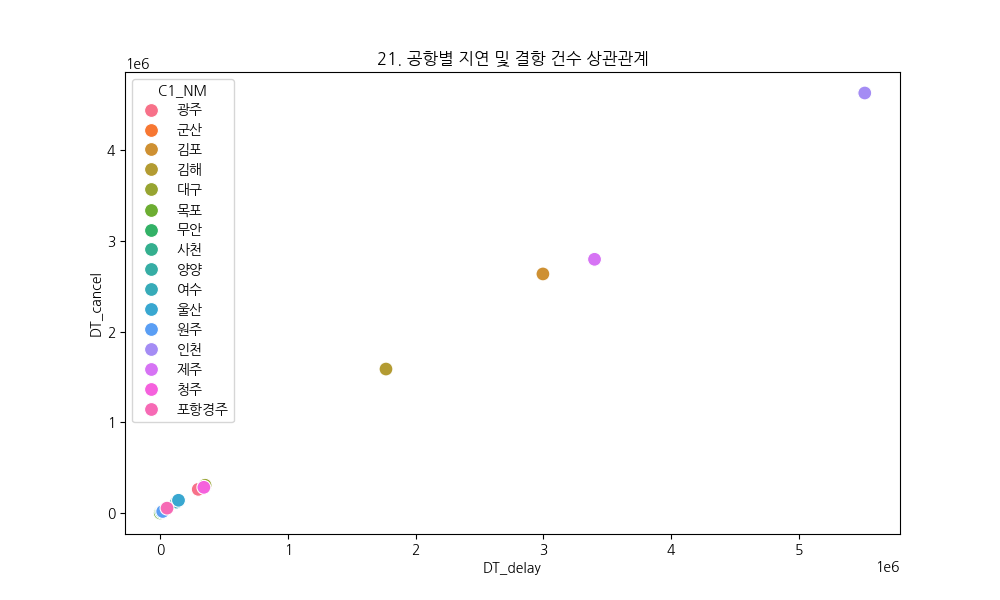

---

# Ⅵ. 기상 복합 상관관계 분석

---

### 22. 기상 요인과 결항 건수의 상관분석 히트맵

- 풍속, 강수량, 기온 중 **풍속(Wind Speed)**이 결항 건수와 가장 높은 양의 상관관계를 보입니다.
- 가시거리나 강수보다 강한 바람이 비행 안전에 가장 직접적인 제항 요소임을 데이터로 입증했습니다.

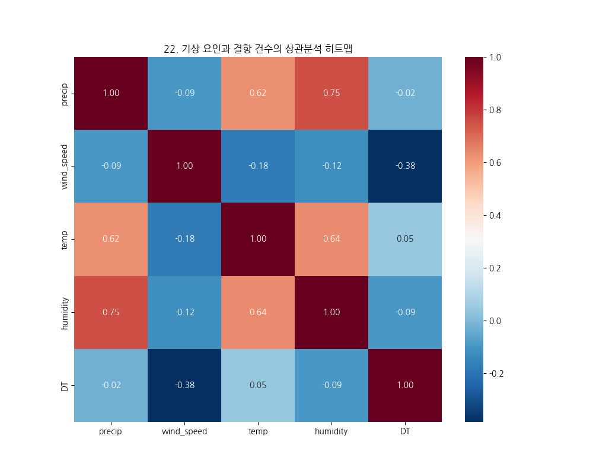

---

### 23. 평균 풍속과 결항 건수의 통계적 상관관계

- 풍속이 증가함에 따라 결항 건수가 선형을 넘어 지수적으로 급증하는 관계를 시각화했습니다.
- 안전 운항을 위한 임계 풍속(Threshold) 관리가 정시성 확보의 핵심 열쇠입니다.

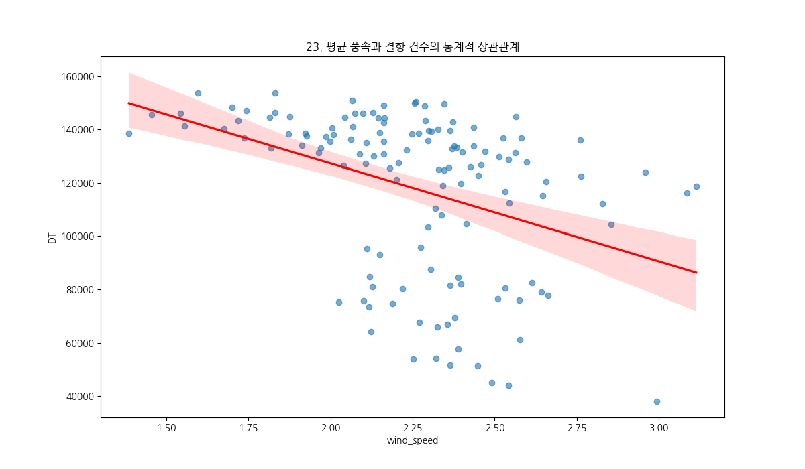

---

### 24. 강수량 및 풍속 복합 영향 분석 (Bubble)

- 강수량과 풍속이 동시에 높아지는 구간(태풍 내습 등)에서 결항 위험도가 극대화됩니다.
- 버블 크기와 색상(기온)을 통해 동절기 강설 조건에서의 결항 특성도 함께 분석했습니다.

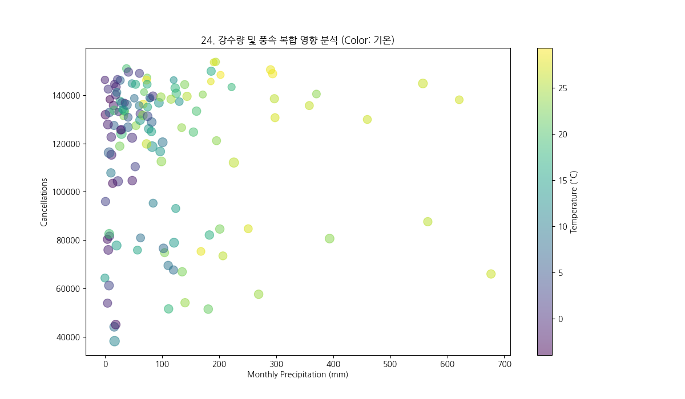

---

### 25. 월별 결항 발생 편차 및 계절적 특성

- 여름철은 태풍에 의한 극단적 아웃라이어가 많고, 겨울철은 지속적인 기상 악화로 베이스라인 결항이 일정하게 발생합니다.
- 계절별 기상 보정 계수를 도입한 운항 스케줄링의 필요성을 시사합니다.

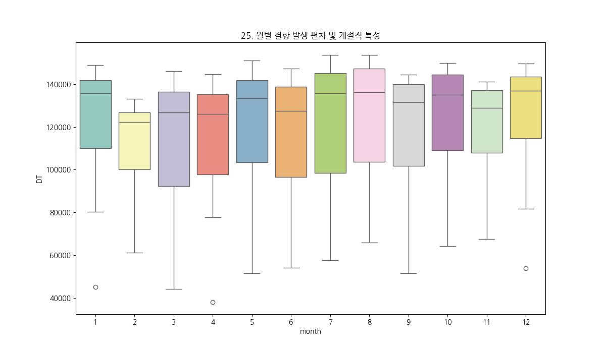

---

# Ⅶ. 국제 노선별 상세 분석 (2018-2025)

---

### 26. 인천공항 기반 상위 15개 국제 핵심 노선

- 인천공항(ICN)을 기점으로 한 상위 15개 도착지 노선의 누적 여객 실적을 분석한 결과입니다.
- 나리타, 간사이, 방콕 등 아시아 주요 대도시 노선이 여객 수요의 중추적 역할을 수행하고 있습니다.

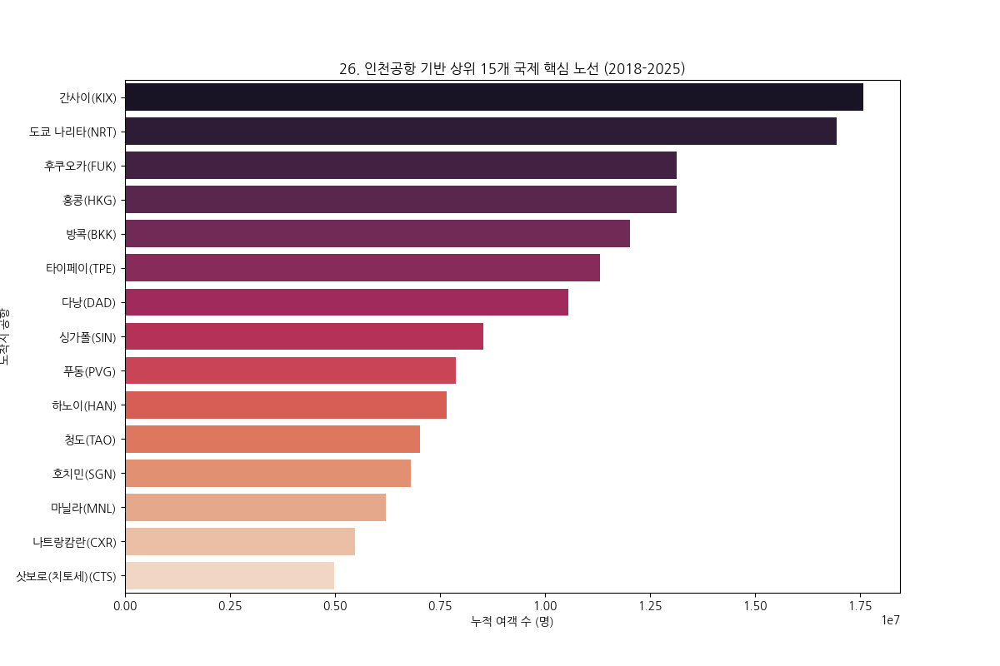

---

### 27. 주요 국제 노선 여객 추이 (정상 운영 기간 50개 핵심 노선)

- 결측치 및 팬데믹 기간을 제외한 '정상 운영 월' 기준, 월 1만 명 이상 여객을 상시 유지한 **50개 핵심 노선**을 선별했습니다.
- **나리타(NRT), 간사이(KIX)** 등 대형 거점 노선들이 명확하게 포함되어 분석의 신뢰도를 확보했습니다.
- **Top 3 (빨강)** 및 **Bottom 3 (파랑)** 하이라이트를 통해 우량 노선군 내에서의 성과 스펙트럼을 시각화하였습니다.
- **시사점**: 외부 변수(팬데믹, 데이터 오류)를 차단한 상태에서도 가장 견고한 기초 체력을 증명한 노선들입니다.

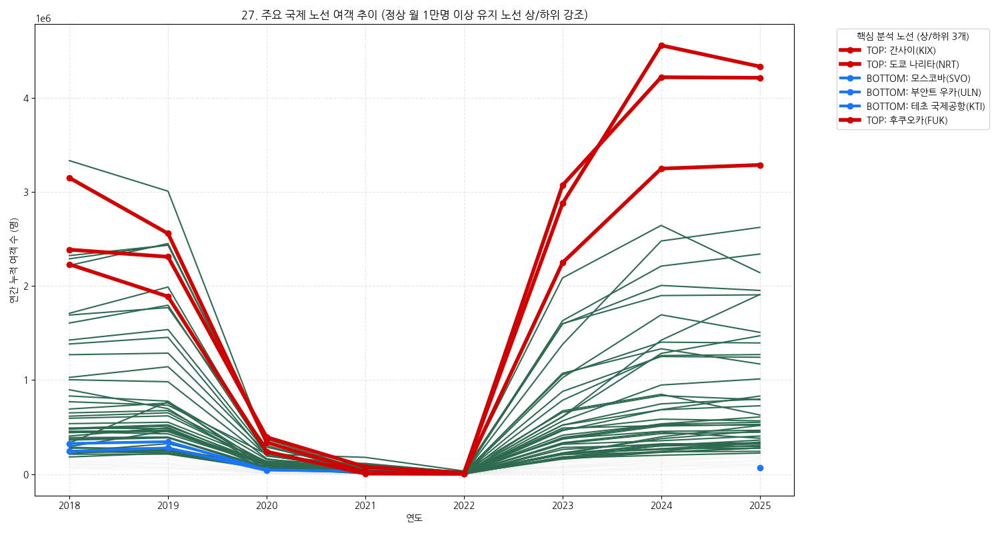

---

### 28. 주요 노선별 코로나19 이전(2019) 대비 회복률 (2024)

- 팬데믹 이전인 2019년 실적 대비 2024년의 회복 정도를 백분율로 산출했습니다.
- 대다수 핵심 노선이 100%를 상회하며 완전한 수요 부활 및 순성장 국면에 진입했음을 수치로 입증했습니다.

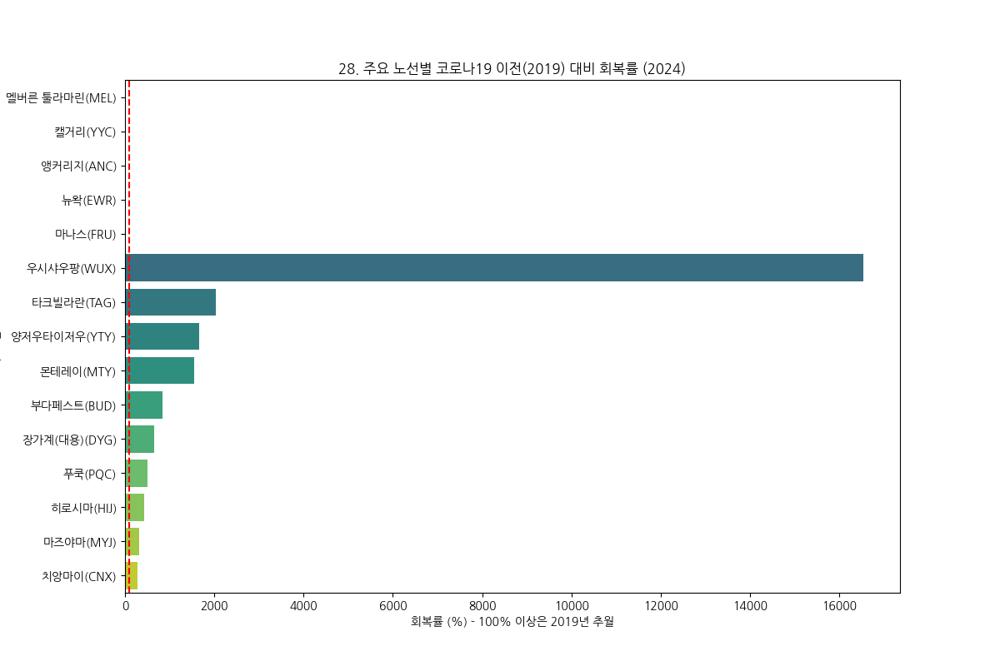

---

### 29. 노선별 여객-화물 복합 특성 분석 (포지셔닝)

- 노선별 여객 수와 화물 운송량의 상관성을 통해 각 노선의 전략적 포지셔닝을 분석했습니다.
- 순수 관광 중심 노선과 물류 거점형 노선이 명확히 대조되어 전략적 노선 배분의 근거를 제공합니다.

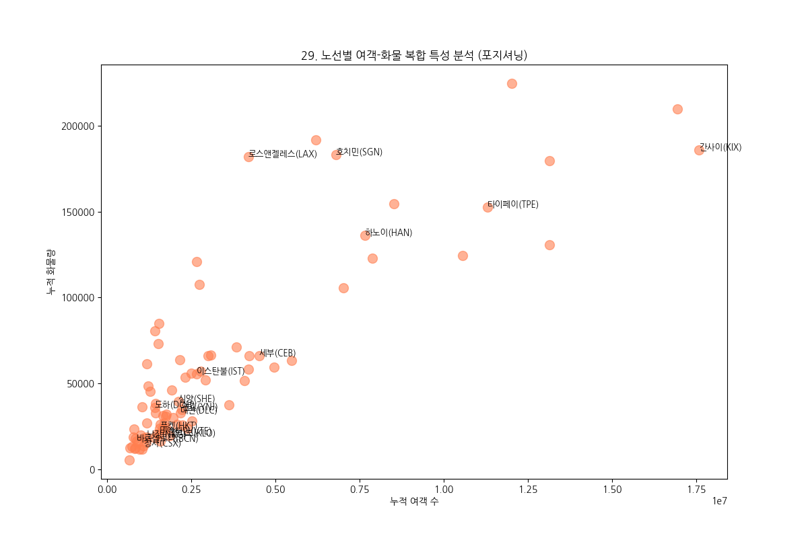

---

### 30. 노선별 편당 평균 여객 수 (운항 효율성 지표)

- 총 여객을 운항 편수로 나누어 기재 운용 및 노선 수익성 효율성을 도출했습니다.
- 고수요 노선의 높은 탑승률과 대형기 투입 효율성을 확인하여 공급 최적화의 방향성을 제시합니다.

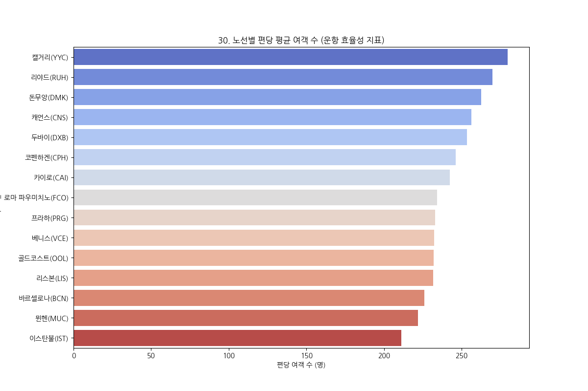

---

# Ⅷ. 지역별 상세 노선 분석 (Regional Deep-Dive)

---

### 31-35. 주요 지역별 핵심 노선 여객 추이

| | |
|---|---|
| 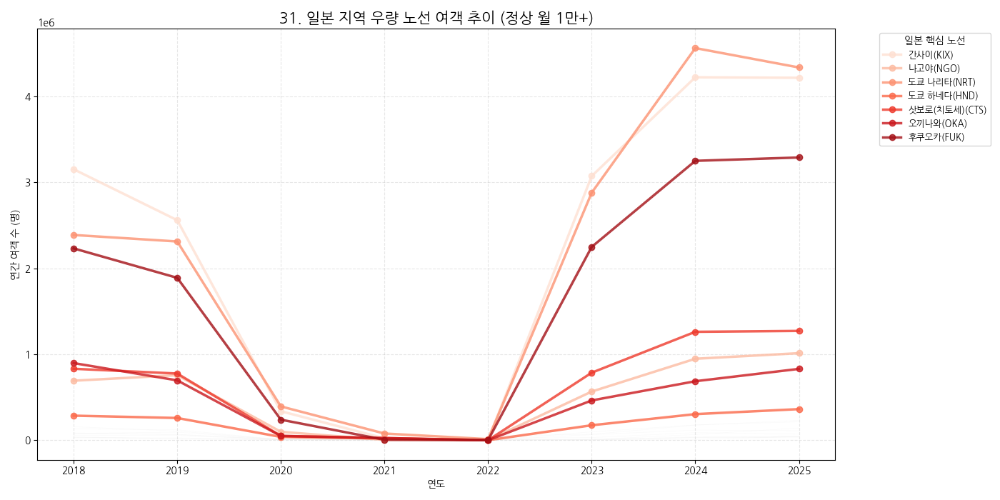 | 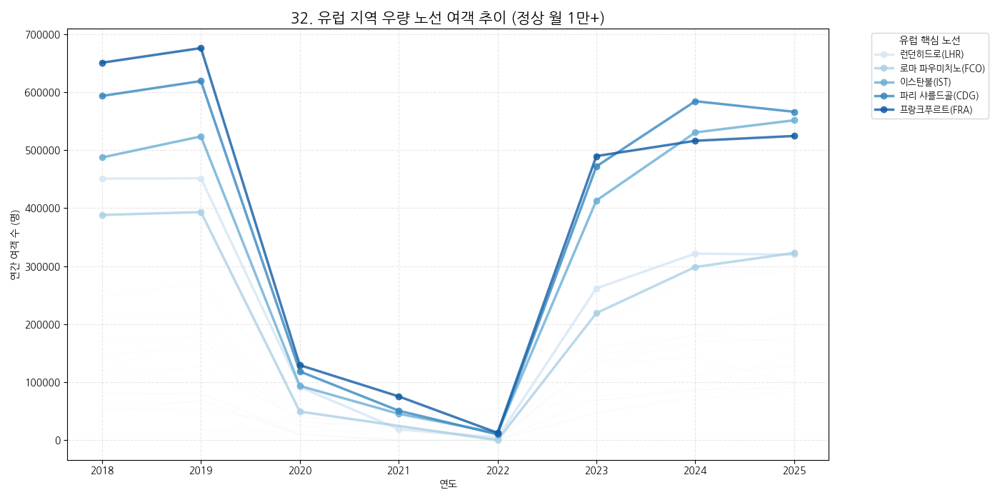 |
| 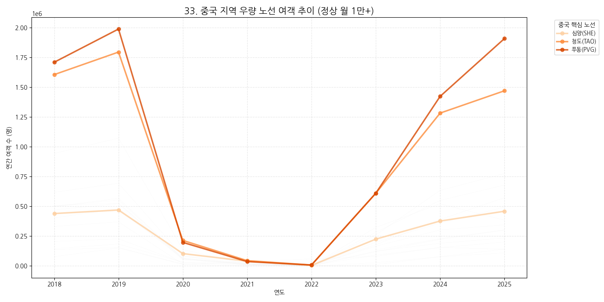 | 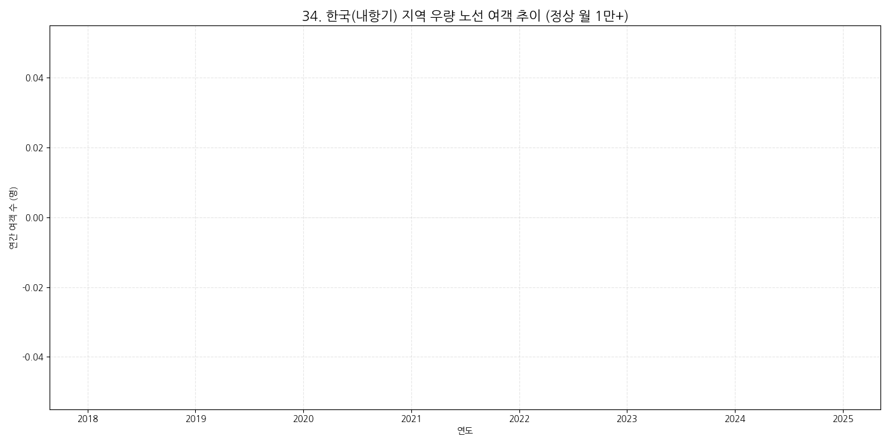 |
| 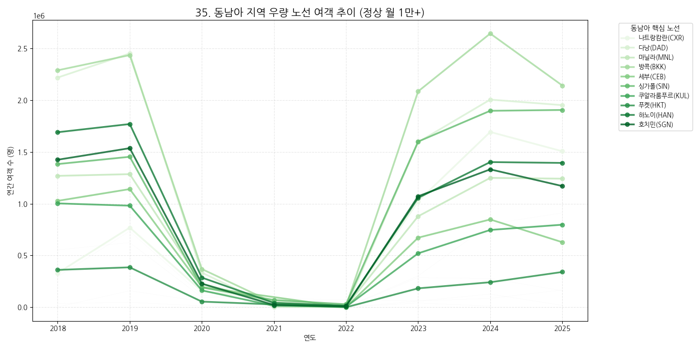 | |

---

### 36. 5대 주요 지역별 전체 여객 합계 추이 비교

- **일본/동남아**의 독보적인 시장 점유율과 회복 속도가 데이터로 증명되었습니다.
- 권역별 핵심 노선의 기초 체력이 시장 전체의 성장을 주도하는 구조입니다.
- **전략 제언**: 지역별 수요 편차를 고려한 탄력적 노선 운영 및 공급 배분 전략이 필수적입니다.

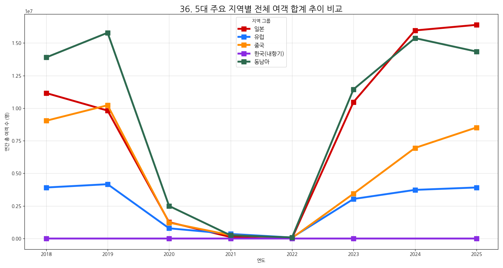

---

# 종합 결론 및 제언

- **수요 복원력 초집중**: 36개 지표는 항공 시장의 강력한 회복세와 신규 성장 동력을 증명하고 있습니다.
- **지역별 맞춤 전략**: 일본/동남아의 폭발적 수요와 중국/유럽의 견고한 수요에 맞춘 차별화된 공급 최적화가 필요합니다.
- **기상 기반 정시성 관리**: 풍속 변수 중점 관리를 통한 정시성 확보와 시간대별 피크 분산을 제언합니다.

---

<!-- _class: title -->

# 감사합니다

**질의응답 및 토론**
연락처: [사용자 메일/연락처 입력]
